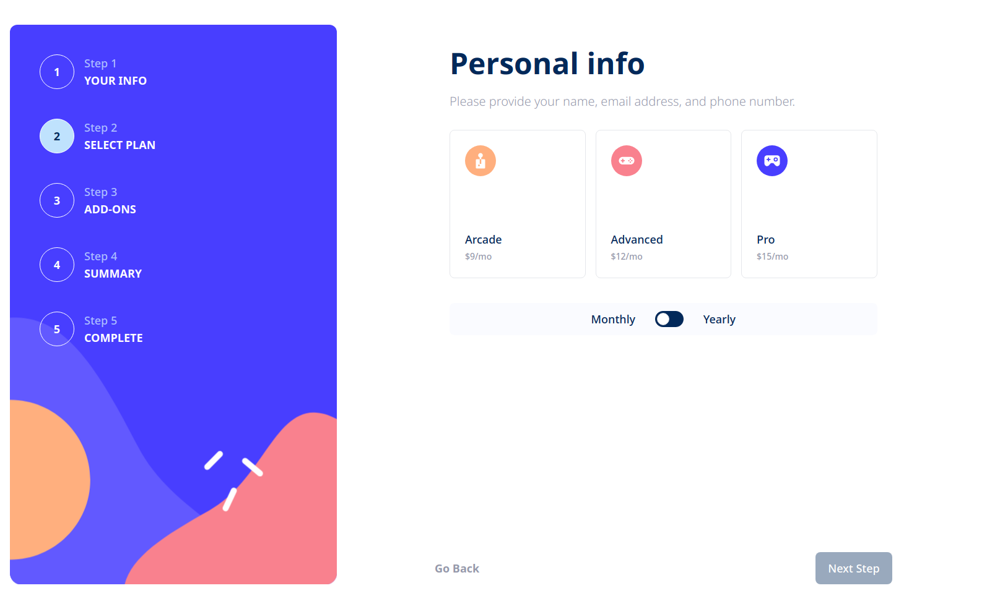
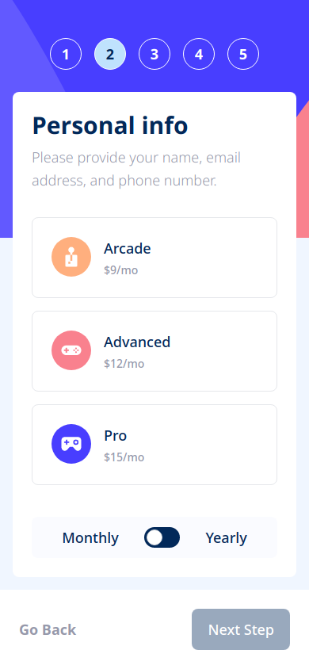

# Next.js TypeScript TailwindCSS & Sass Starter

Use TypeScript, TailwindCSS & Sass to quick start your new Next.js app!!




```
yarn dev
# or
npm run dev
```

Open [http://localhost:3000](http://localhost:3000) with your browser to see your new project!

## 📚 Learn More About Next.js

To learn more about Next.js, take a look at the following resources:

- [Next.js Documentation](https://nextjs.org/docs) - learn about Next.js features and API.
- [Learn Next.js](https://nextjs.org/learn) - an interactive Next.js tutorial.

You can check out [the Next.js GitHub repository](https://github.com/vercel/next.js/) - your feedback and contributions are welcome!
